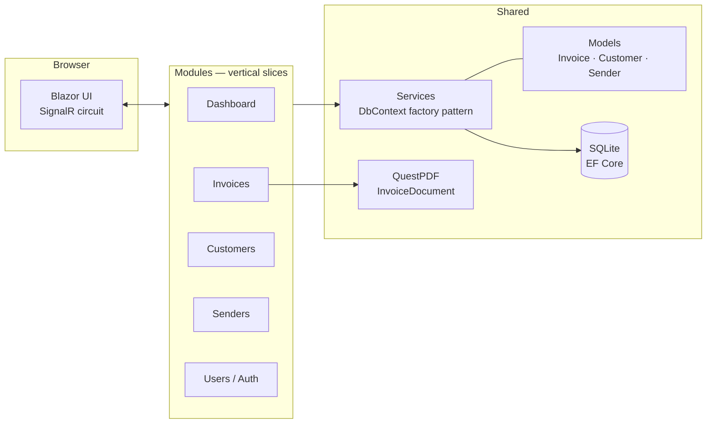
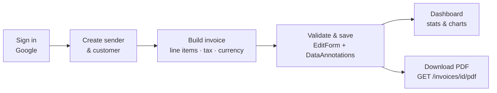

# InvoiceBuilder

A full-stack invoicing app built with **.NET 9 Blazor** (Interactive Server). Manage senders, customers, and invoices with line items — then download any invoice as a polished **PDF**. Includes a dashboard with revenue charts, Google OAuth sign-in, and a Tailwind-styled responsive UI.

## What is this?

InvoiceBuilder is a small, self-contained invoicing tool: it models the three things an invoice actually needs — **who's billing** (`Sender`), **who's being billed** (`Customer`), and **the invoice itself** (line items, tax rate, currency, due date) — and gives each one full CRUD pages. Every invoice can be rendered to a downloadable PDF, and a dashboard summarizes outstanding balances, overdue/due-soon counts, and monthly revenue.

It's built as a single Blazor Server app (no separate API/frontend split) so the whole request/response/UI-update cycle runs over one SignalR circuit — the server holds UI state and pushes diffs to the browser instead of shipping a client-side app. This is a personal/learning project, not a production SaaS: auth is intentionally open to any Google account (no allow-list, no billing, no multi-tenant isolation).

## Screenshots

| Sign in | Dashboard |
|---|---|
|  |  |

| Invoice list | Invoice editor |
|---|---|
|  |  |

| Invoice view (source for the PDF) |
|---|
|  |

## Tech Stack

| Layer | Technology |
|---|---|
| UI | Blazor Server (SignalR), Tailwind CSS v4, MudBlazor |
| Backend | ASP.NET Core (.NET 9), vertical slice architecture |
| Data | EF Core + SQLite (code-first migrations, auto-applied on startup) |
| Auth | ASP.NET Core Identity + Google OAuth (no local passwords) |
| PDF | QuestPDF |

## Architecture

Features are organized as **vertical slices** under `Modules/` — each slice owns its pages, private components, and service. Shared building blocks (domain models, DbContext, cross-cutting services) live at the root.



Key design decisions:

- **Vertical slices, no slice-to-slice references** — shared logic moves down to `Models/`, `Data/`, or `Components/Shared/`, keeping features independent.
- **`IDbContextFactory` with short-lived contexts** — the correct EF Core pattern for Blazor Server, avoiding state leaks across a circuit's concurrent renders. Reads use `AsNoTracking()`.
- **Disconnected graph reconciliation** — invoice updates diff line items (add/update/remove) instead of a blanket update, so deleted rows are actually removed.
- **Migrations + seed data run at startup** — clone, run, done. No manual database setup.

### Why Blazor Server, not WASM

Interactive Server mode means the actual UI state (component tree, event handlers) lives on the server; the browser only holds a thin SignalR connection and DOM diffs get pushed down. This is the right tradeoff for an internal/small-scale invoicing tool: no separate REST API to design, no client-side state management library, full access to `DbContext`/EF Core directly from a component's code-behind, and no bundle-size concerns from shipping .NET to the browser via WASM. The cost — a persistent connection per user, no offline mode — doesn't matter at this scale.

### Data access: factory pattern, not a scoped `DbContext`

A Blazor Server "circuit" is a single, long-lived object graph that can have multiple components rendering concurrently (e.g. a page and a dialog both querying at once). Handing all of that a single scoped `DbContext` would let concurrent renders trip over the same tracked-entity change tracker. Instead, every service (`SenderService`, `CustomerService`, `InvoiceService`, `DashboardService`) takes an `IDbContextFactory<ApplicationDbContext>` and opens a fresh, short-lived context per method call:

```csharp
public async Task<List<Invoice>> GetAllAsync()
{
    await using var db = _factory.CreateDbContext();
    return await db.Invoices.AsNoTracking().ToListAsync();
}
```

Reads use `AsNoTracking()` since nothing needs to be re-saved from a read. The one place tracking matters is `InvoiceService.UpdateAsync`, which loads the tracked `Invoice` + `LineItems` graph and manually diffs added/changed/removed line items — a blanket `db.Update()` would silently leave deleted line items in the database.

### PDF rendering

`Services/InvoiceDocument.cs` implements QuestPDF's `IDocument` interface and lays out the invoice (header, sender/customer blocks, line-item table, totals, notes) using the Fluent API — the same `Invoice` model the Blazor page renders, just fed to a different renderer. A single minimal-API endpoint, `GET /invoices/{id}/pdf` (defined at the bottom of `Program.cs` — the one non-component HTTP route in the app), loads the invoice, generates the PDF in-memory, and streams it back as a file download.

### Auth

ASP.NET Core Identity handles the user store, but there are no local passwords — the only sign-in path is Google OAuth (`AddGoogle` in `Program.cs`), and `AccountEndpoints.ExternalLoginCallback` auto-provisions a local `ApplicationUser` for any Google account that has an email claim, on first sign-in. There's no allow-list: this is a personal/learning project, not a multi-tenant product, so anyone with a Google account can sign in and see the same shared data. In Development, `DevAuthEndpoints` adds a one-click "Continue as Test User" button that skips OAuth entirely.

## Invoice Flow



## Getting Started

```powershell
npm install        # Tailwind CLI (build shells out to it)
dotnet user-secrets set "Authentication:Google:ClientId" "<id>"
dotnet user-secrets set "Authentication:Google:ClientSecret" "<secret>"
dotnet run         # http://localhost:5036
```

The SQLite database is created, migrated, and seeded with sample data automatically on first run. In Development, a one-click **"Continue as Test User"** button skips OAuth setup.

## Project Structure

```
Modules/            # Vertical slices: Dashboard, Invoices, Customers, Senders, Users
  Invoices/
    Pages/          # Routable pages (list, edit, view)
    Components/     # Slice-private components
Models/             # Domain entities + DataAnnotations validation
Data/               # ApplicationDbContext, migrations
Services/           # Cross-cutting services, QuestPDF invoice document
Components/         # App shell, layout, shared components
app.css             # Tailwind source (compiled to wwwroot/app.css at build)
```
