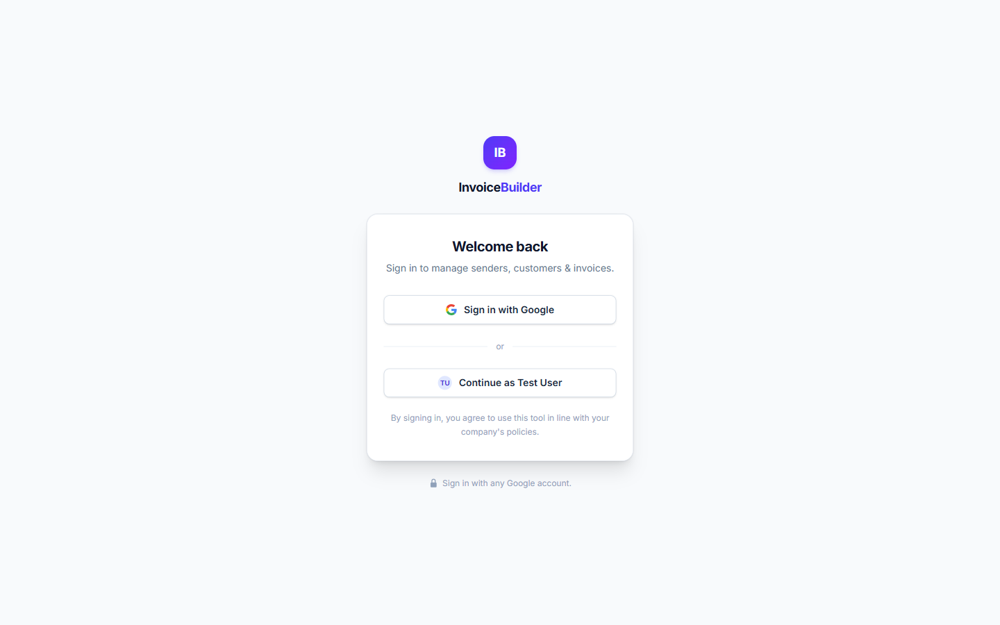
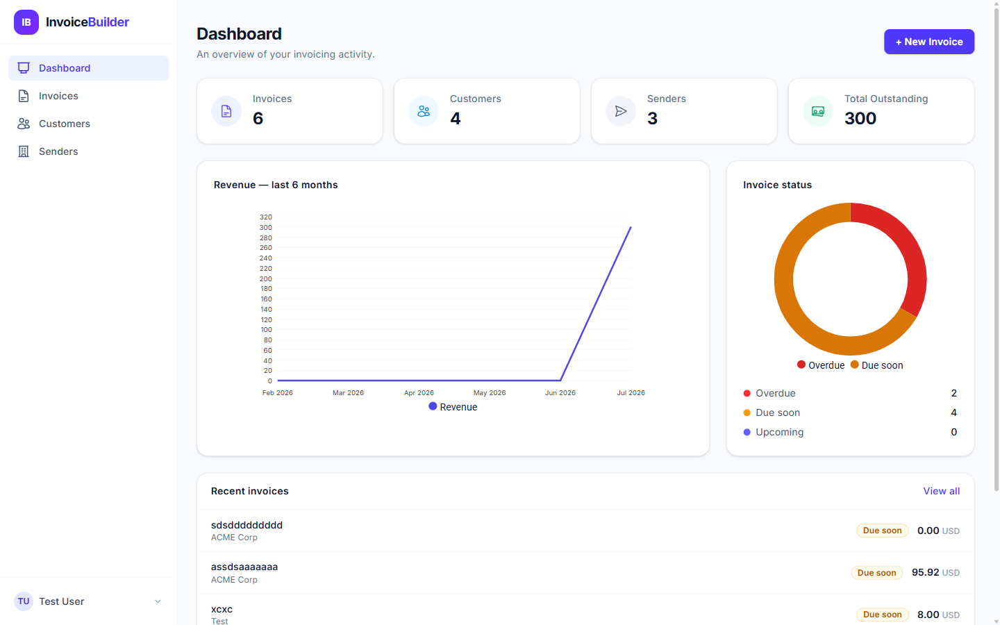
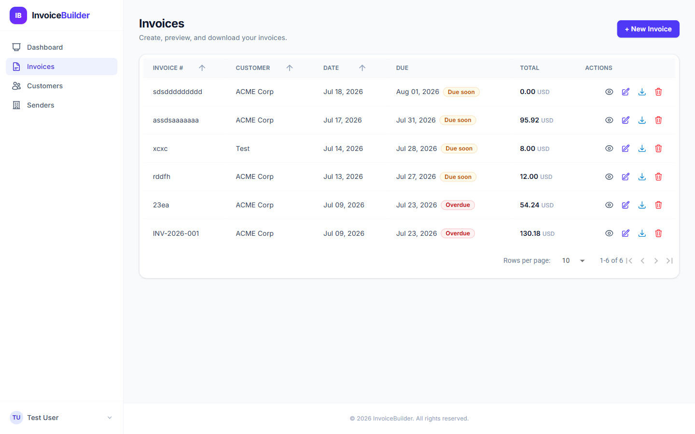
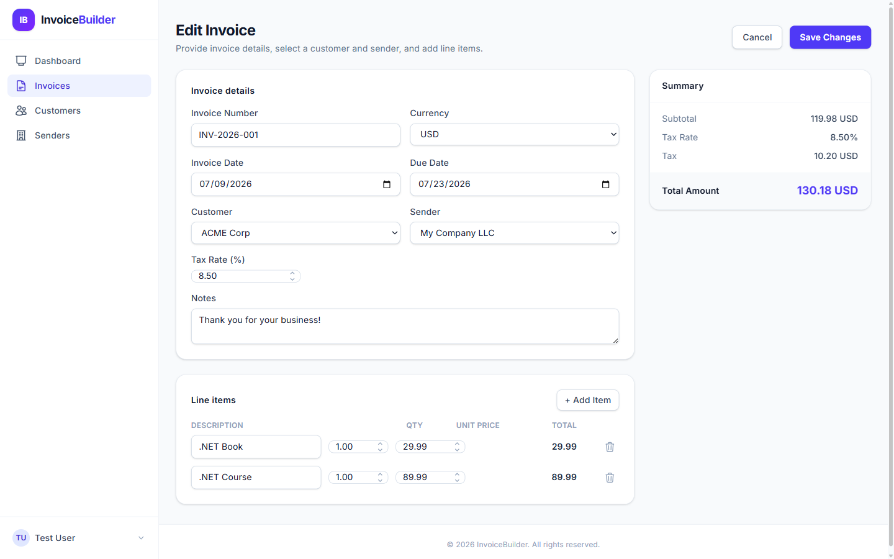
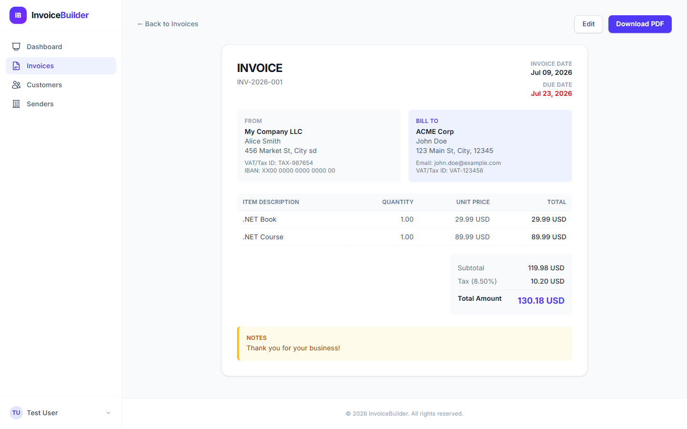
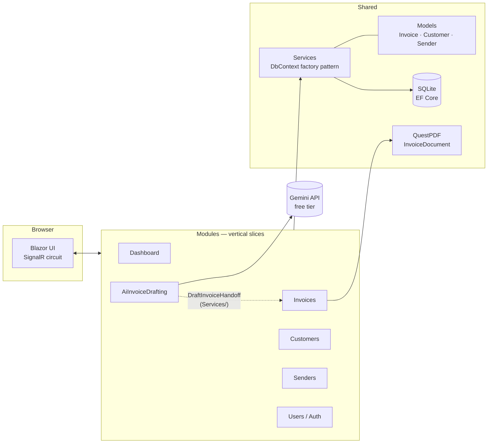
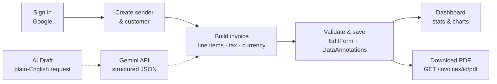

# InvoiceBuilder

A full-stack invoicing app built with **.NET 9 Blazor** (Interactive Server). Manage senders, customers, and invoices with line items — then download any invoice as a polished **PDF**. Includes a dashboard with revenue charts, Google OAuth sign-in, a Tailwind-styled responsive UI, and an **AI-assisted invoice drafting** feature powered by Gemini.

## What is this?

InvoiceBuilder is a small, self-contained invoicing tool: it models the three things an invoice actually needs — **who's billing** (`Sender`), **who's being billed** (`Customer`), and **the invoice itself** (line items, tax rate, currency, due date) — and gives each one full CRUD pages. Every invoice can be rendered to a downloadable PDF, and a dashboard summarizes outstanding balances, overdue/due-soon counts, and monthly revenue. A dedicated **AI Draft** page turns a plain-English request ("bill Acme Corp for 10 hours of consulting at $150/hr") into an editable invoice draft, so you can skip the manual line-item entry for straightforward invoices.

It's built as a single Blazor Server app (no separate API/frontend split) so the whole request/response/UI-update cycle runs over one SignalR circuit — the server holds UI state and pushes diffs to the browser instead of shipping a client-side app. This is a personal/learning project, not a production SaaS: auth is intentionally open to any Google account (no allow-list, no billing, no multi-tenant isolation).

## Screenshots

| Sign in | Dashboard |
|---|---|
|  |  |

| Invoice list | Invoice editor |
|---|---|
|  |  |

| Invoice view (source for the PDF) |
|---|
|  |

## Tech Stack

| Layer | Technology |
|---|---|
| UI | Blazor Server (SignalR), Tailwind CSS v4, MudBlazor |
| Backend | ASP.NET Core (.NET 9), vertical slice architecture |
| Data | EF Core + SQLite (code-first migrations, auto-applied on startup) |
| Auth | ASP.NET Core Identity + Google OAuth (no local passwords) |
| PDF | QuestPDF |
| AI | Google Gemini API (free tier), structured JSON output |

## Architecture

Features are organized as **vertical slices** under `Modules/` — each slice owns its pages, private components, and service. Shared building blocks (domain models, DbContext, cross-cutting services) live at the root.



Key design decisions:

- **Vertical slices, no slice-to-slice references** — shared logic moves down to `Models/`, `Data/`, or `Components/Shared/`, keeping features independent.
- **`IDbContextFactory` with short-lived contexts** — the correct EF Core pattern for Blazor Server, avoiding state leaks across a circuit's concurrent renders. Reads use `AsNoTracking()`.
- **Disconnected graph reconciliation** — invoice updates diff line items (add/update/remove) instead of a blanket update, so deleted rows are actually removed.
- **Migrations + seed data run at startup** — clone, run, done. No manual database setup.
- **AI drafting hands off through a shared scoped service, not a cross-slice call** — `AiInvoiceDrafting` and `Invoices` never reference each other's services directly; a small `DraftInvoiceHandoff` in `Services/` carries the parsed draft between them.

### Why Blazor Server, not WASM

Interactive Server mode means the actual UI state (component tree, event handlers) lives on the server; the browser only holds a thin SignalR connection and DOM diffs get pushed down. This is the right tradeoff for an internal/small-scale invoicing tool: no separate REST API to design, no client-side state management library, full access to `DbContext`/EF Core directly from a component's code-behind, and no bundle-size concerns from shipping .NET to the browser via WASM. The cost — a persistent connection per user, no offline mode — doesn't matter at this scale.

### Data access: factory pattern, not a scoped `DbContext`

A Blazor Server "circuit" is a single, long-lived object graph that can have multiple components rendering concurrently (e.g. a page and a dialog both querying at once). Handing all of that a single scoped `DbContext` would let concurrent renders trip over the same tracked-entity change tracker. Instead, every service (`SenderService`, `CustomerService`, `InvoiceService`, `DashboardService`) takes an `IDbContextFactory<ApplicationDbContext>` and opens a fresh, short-lived context per method call:

```csharp
public async Task<List<Invoice>> GetAllAsync()
{
    await using var db = _factory.CreateDbContext();
    return await db.Invoices.AsNoTracking().ToListAsync();
}
```

Reads use `AsNoTracking()` since nothing needs to be re-saved from a read. The one place tracking matters is `InvoiceService.UpdateAsync`, which loads the tracked `Invoice` + `LineItems` graph and manually diffs added/changed/removed line items — a blanket `db.Update()` would silently leave deleted line items in the database.

### PDF rendering

`Services/InvoiceDocument.cs` implements QuestPDF's `IDocument` interface and lays out the invoice (header, sender/customer blocks, line-item table, totals, notes) using the Fluent API — the same `Invoice` model the Blazor page renders, just fed to a different renderer. A single minimal-API endpoint, `GET /invoices/{id}/pdf` (defined at the bottom of `Program.cs` — the one non-component HTTP route in the app), loads the invoice, generates the PDF in-memory, and streams it back as a file download.

### Auth

ASP.NET Core Identity handles the user store, but there are no local passwords — the only sign-in path is Google OAuth (`AddGoogle` in `Program.cs`), and `AccountEndpoints.ExternalLoginCallback` auto-provisions a local `ApplicationUser` for any Google account that has an email claim, on first sign-in. There's no allow-list: this is a personal/learning project, not a multi-tenant product, so anyone with a Google account can sign in and see the same shared data. In Development, `DevAuthEndpoints` adds a one-click "Continue as Test User" button that skips OAuth entirely.

### AI invoice drafting

The **AI Draft** page (`Modules/AiInvoiceDrafting/Pages/AiInvoiceDraft.razor`, route `/ai-invoice-draft`) turns a plain-English request into an editable invoice draft — nothing is written to the database until the user reviews it and explicitly saves.

**How it works, end to end:**

1. **Request** — the user types something like *"Bill Acme Corp for 10 hours of consulting at $150/hr, due in 2 weeks, 8.5% tax"* into a textarea. A cheap client-side check (`AiInvoiceDraft.razor`'s `Validate`) rejects blank/too-short input before spending an API call.
2. **Prompt** — `GeminiInvoiceDraftService.DraftAsync` builds a prompt that includes today's date (so the model can resolve "next month"/"in 2 weeks" itself) and the **exact list of existing customer names** (via `AiDraftLookupService.GetCustomerNamesAsync`), so the model can resolve loose variants ("ACME Corp" vs "Acme Corporation") to the customer already on file instead of creating a near-duplicate. The prompt also explicitly forbids inventing a line item it can't price (e.g. "2% of their outstanding balance" with no balance given).
3. **Structured output** — the request sets Gemini's `responseMimeType: application/json` + a `responseSchema`, so the model is constrained to return a fixed JSON shape (customer name, dates, tax rate, notes, line items) instead of free-form prose that would need fragile regex parsing.
4. **Draft preview** — the parsed `DraftInvoiceResult` is rendered read-only: a badge shows whether the customer matched an existing record, and any line item with a `$0.00` unit price is flagged so it's obvious something needs manual input before saving.
5. **Handoff, not a direct save** — clicking "Continue to Invoice Editor" stores the draft in `DraftInvoiceHandoff` (a scoped, in-memory, same-circuit handoff service in `Services/`) and navigates to the existing `/invoices/new` page. `InvoiceEdit.razor` picks up the pending draft once, prefills the normal invoice form (customer dropdown, dates, tax rate, line items), and the user finishes through the **exact same validated `EditForm` + `Save()` flow** used for manually-created invoices — no parallel/duplicated save logic.

This design keeps the two slices decoupled per the vertical-slice rules (`AiInvoiceDrafting` never calls into `Invoices`' or `Customers`' services — it has its own minimal `AiDraftLookupService` for read-only customer-name lookups) while still reusing 100% of the existing invoice creation and validation logic.

**Setup:** the Gemini API key is read from configuration (`Ai:Gemini:ApiKey`), left empty in `appsettings.json`, and meant to be supplied via user-secrets or an environment variable — see [Getting Started](#getting-started).

## Invoice Flow



## Getting Started

```powershell
npm install        # Tailwind CLI (build shells out to it)
dotnet user-secrets set "Authentication:Google:ClientId" "<id>"
dotnet user-secrets set "Authentication:Google:ClientSecret" "<secret>"
dotnet user-secrets set "Ai:Gemini:ApiKey" "<gemini-api-key>"   # optional — only needed for the AI Draft page
dotnet run         # http://localhost:5036
```

The SQLite database is created, migrated, and seeded with sample data automatically on first run. In Development, a one-click **"Continue as Test User"** button skips OAuth setup.

Get a free Gemini API key from [Google AI Studio](https://aistudio.google.com/apikey) — keys created there (rather than directly in Google Cloud Console) are provisioned against the free tier by default. Without a key set, every other feature works normally; only the `/ai-invoice-draft` page needs it.

## Project Structure

```
Modules/            # Vertical slices: Dashboard, Invoices, Customers, Senders, Users, AiInvoiceDrafting
  Invoices/
    Pages/          # Routable pages (list, edit, view)
    Components/     # Slice-private components
  AiInvoiceDrafting/
    Pages/          # AI Draft page
    GeminiInvoiceDraftService.cs   # Calls the Gemini API, parses structured JSON output
    AiDraftLookupService.cs        # Read-only customer-name lookups for match-suggestion
Models/             # Domain entities + DataAnnotations validation
Data/               # ApplicationDbContext, migrations
Services/           # Cross-cutting services, QuestPDF invoice document, DraftInvoiceHandoff
Components/         # App shell, layout, shared components
app.css             # Tailwind source (compiled to wwwroot/app.css at build)
```
