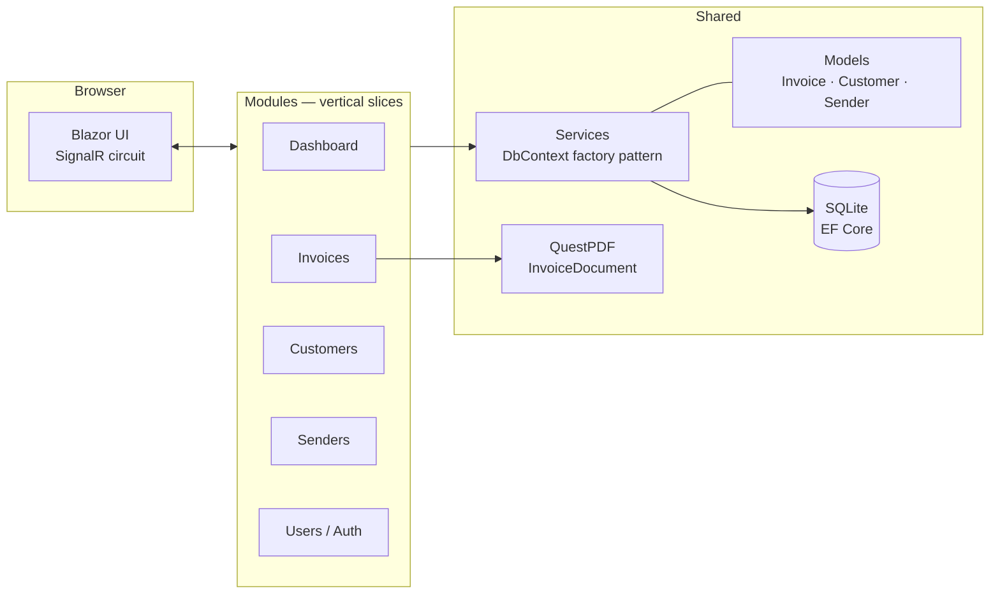
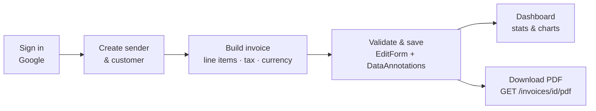

# InvoiceBuilder

A full-stack invoicing app built with **.NET 9 Blazor** (Interactive Server). Manage senders, customers, and invoices with line items — then download any invoice as a polished **PDF**. Includes a dashboard with revenue charts, Google OAuth sign-in, and a Tailwind-styled responsive UI.

## Tech Stack

| Layer | Technology |
|---|---|
| UI | Blazor Server (SignalR), Tailwind CSS v4, MudBlazor |
| Backend | ASP.NET Core (.NET 9), vertical slice architecture |
| Data | EF Core + SQLite (code-first migrations, auto-applied on startup) |
| Auth | ASP.NET Core Identity + Google OAuth (no local passwords) |
| PDF | QuestPDF |

## Architecture

Features are organized as **vertical slices** under `Modules/` — each slice owns its pages, private components, and service. Shared building blocks (domain models, DbContext, cross-cutting services) live at the root.



Key design decisions:

- **Vertical slices, no slice-to-slice references** — shared logic moves down to `Models/`, `Data/`, or `Components/Shared/`, keeping features independent.
- **`IDbContextFactory` with short-lived contexts** — the correct EF Core pattern for Blazor Server, avoiding state leaks across a circuit's concurrent renders. Reads use `AsNoTracking()`.
- **Disconnected graph reconciliation** — invoice updates diff line items (add/update/remove) instead of a blanket update, so deleted rows are actually removed.
- **Migrations + seed data run at startup** — clone, run, done. No manual database setup.

## Invoice Flow



## Getting Started

```powershell
npm install        # Tailwind CLI (build shells out to it)
dotnet user-secrets set "Authentication:Google:ClientId" "<id>"
dotnet user-secrets set "Authentication:Google:ClientSecret" "<secret>"
dotnet run         # http://localhost:5036
```

The SQLite database is created, migrated, and seeded with sample data automatically on first run. In Development, a one-click **"Continue as Test User"** button skips OAuth setup.

## Project Structure

```
Modules/            # Vertical slices: Dashboard, Invoices, Customers, Senders, Users
  Invoices/
    Pages/          # Routable pages (list, edit, view)
    Components/     # Slice-private components
Models/             # Domain entities + DataAnnotations validation
Data/               # ApplicationDbContext, migrations
Services/           # Cross-cutting services, QuestPDF invoice document
Components/         # App shell, layout, shared components
app.css             # Tailwind source (compiled to wwwroot/app.css at build)
```
